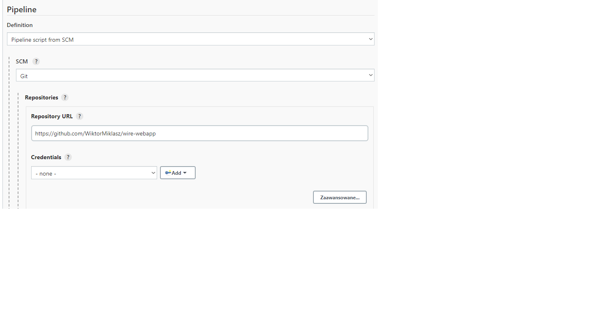
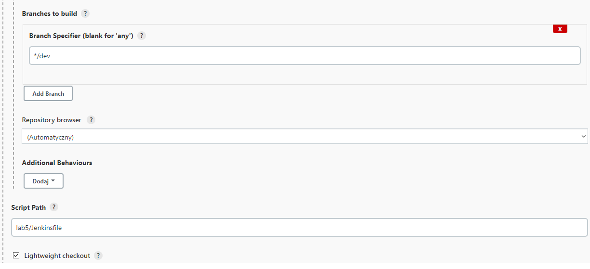
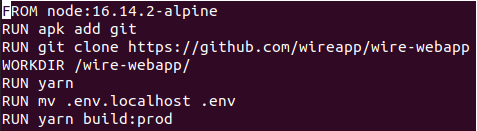
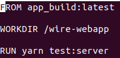
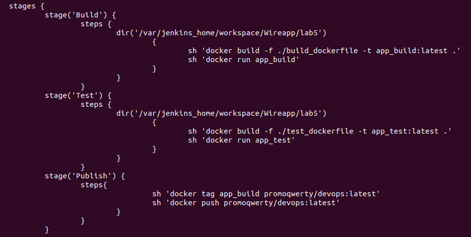
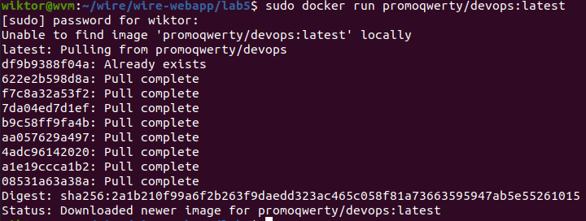

<h3>Przed rozpoczęciem pracy uruchamiam kontenery odpowiadające za jenkinsa, oraz za dinda(docker in a docker). Na kontenerze jenkinsowym dodatkowo loguję się na dockerhubie.
Konfiguracja mojego pipelina wygląda następująco:

Na odpowiednim repozytorium na githubie przygotowałem projekt, w którym w oddzielnym folderze trzymam dockerfile - do builda i do testów - oraz Jenkinsfile, który jest odpowiedzialny za konfigurację pipelina.

Build dockerfile prezentuje się następująco:

Instaluję gita, Klonuję repozytorium, tworzę podfolder w workspace, a następnie uruchamiam jako takiego builda. 

 Tutaj po prostu przechodzę do utworzonego w ramach buildu folderu i uruchamiam skrypt z package.jsona 

Cały proces budowania, testowania i publikowania definiuję w poniższym jenkinsfilu:

Definiuję trzy etapy. W ramach pierwszego wchodzę do folderu do którego zostało sklonowane repozytorium i tworzę obraz oparty na build dockerfilu. Uruchamiam kontener z tym obrazem
Analogicznie postępuję w przypadku etapu Test, natomiast w ramach publikowania zmieniam nazwę obrazu do buildu i publikuję go na docker hubie. W swoim projekcie wykorzystałem aplikację napisaną w Javascripcie. W związku z tym zdecydowałem się realizować publish swojego projektu przez Docker huba. Podjęta została przeze mnie próba wykorzystania npm publish, w związku z tym instalowałem npma na kontenerze Jenkinsowym, jednakże dziwne błędy zniechęciły mnie do kontynuacji.

Jako że deploy odbywa się poza środowiskiem Jenkinsowym, przeprowadzam go budując kontener na hoście z pobranym z docker huba obrazem. W przypadku mojego rozwiązania nie widziałem zbytnio lepszej możliwości zrealizowania tego etapu. Wygląda to tak:

</h3>
 

